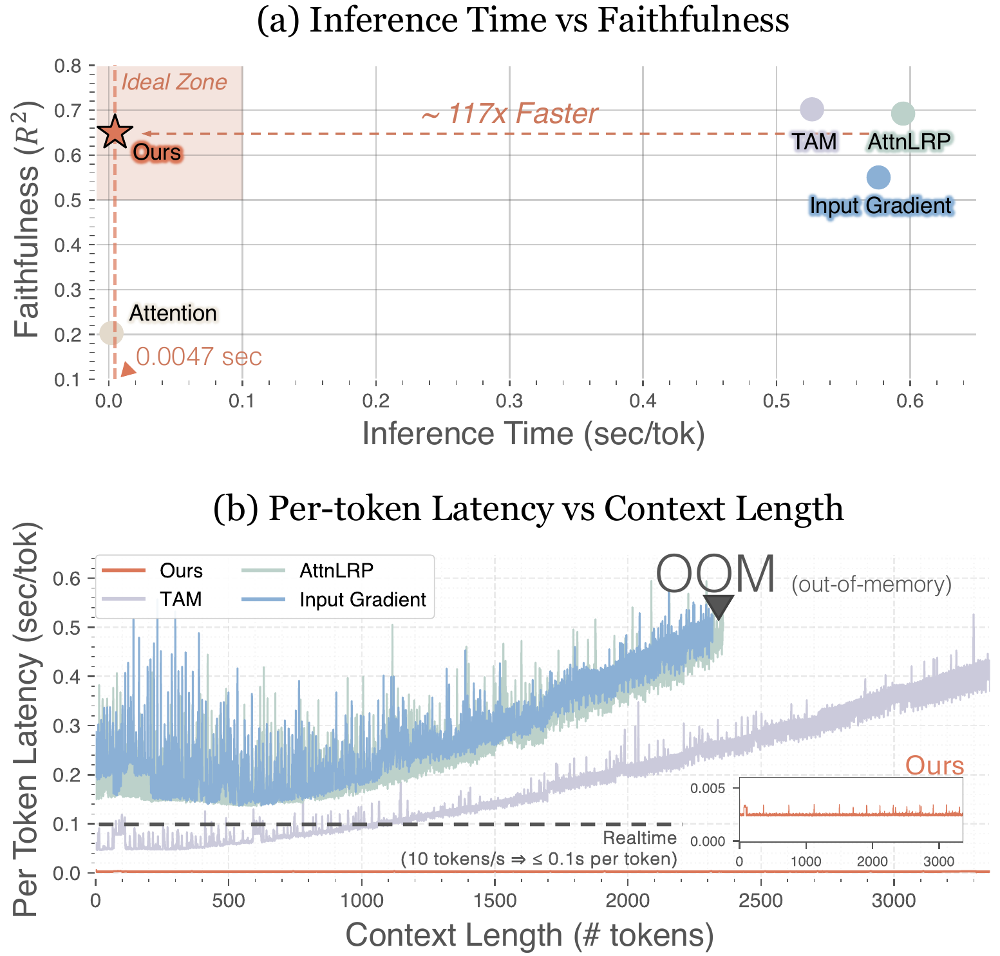
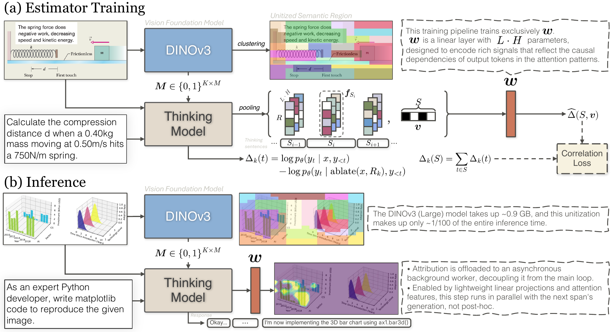

<div align="center">

# vSTREAM

### Real-Time Visual Attribution Streaming in Thinking Models

[Seil Kang](https://www.linkedin.com/in/seilk/)¹ · [Woojung Han](https://www.linkedin.com/in/woojung-han/)¹ · [Junhyeok Kim](https://www.linkedin.com/in/junhyeok-kim-ai/)¹ · [Jinyeong Kim](https://www.linkedin.com/in/jinyeong-kim/)¹ · [Youngeun Kim](https://www.linkedin.com/in/youngeun-kim-3b97b6179/)² · [Seong Jae Hwang](https://micv.yonsei.ac.kr/seongjae)¹

¹Yonsei University  ²Amazon

**[ Paper ↗ ](https://arxiv.org/abs/2604.16587)** &nbsp;·&nbsp; **[ Project Page ↗ ](https://seilk.github.io/vstream/)** &nbsp;·&nbsp; **[ BibTeX ](#citation)** &nbsp;·&nbsp; [ MIT License ](LICENSE)

<br>


</div>

---

<p align="center">
  <a href="https://seilk.github.io/vstream/">
    
  </a>
  <br>
  <em>Existing attribution methods force a choice between faithfulness and efficiency. vSTREAM occupies the top-right region — faithful and real-time.</em>
  <br>
  <strong>▶ <a href="https://seilk.github.io/vstream/">Live animated demo on the project page</a></strong>
</p>

---

## TL;DR

**vSTREAM** is a real-time visual attribution method for multimodal reasoning models. It explains *which image regions ground each step of a thinking trace* — while the model is still generating.

- **Faithful without extra passes.** A linear estimator predicts counterfactual region-ablation effects from attention features that are already computed during generation. No extra backward passes, no repeated inference.
- **Streams as the model thinks.** Attribution runs asynchronously in a background worker, so users can watch attributions appear span-by-span rather than waiting until generation finishes.
- **One estimator, five tasks, four models.** Trained once in ~4.5 hours on a single GPU with 2,000 examples, the estimator reaches faithfulness comparable to gradient- and perturbation-based baselines across five task families and four thinking VLMs.

## Method

<p align="center">
  
</p>

vSTREAM decomposes attribution into three stages:

1. **Semantic Region Unitization.** DINOv3 features partition the image into K ∈ [16, 128] semantically coherent regions via agglomerative clustering with Ward's linkage. No external segmentation masks required.
2. **Attention Feature Extraction.** For each thinking span *S* and region *Rₖ*, mean-pool cross-attention across all layers and heads to form a feature vector **f** ∈ ℝ^(L·H). Since attention is already computed during generation, extraction cost is negligible.
3. **Amortized Estimator & Streaming.** A linear estimator with L·H parameters maps attention features to counterfactual ablation effects. Trained once on 2,000 examples with a Pearson-correlation loss. At inference, attribution runs asynchronously via a producer-consumer queue, adding near-zero latency.

## Status

The reference implementation is being packaged for public release and will land here shortly. In the meantime, the paper and the [live project page](https://seilk.github.io/vstream/) cover the method and results in full. Expected first drop:

- `vstream/` — core estimator, attention hooks, region clustering
- `scripts/train.py` — train the linear estimator (~4.5h on a single GPU)
- `scripts/stream.py` — run streaming attribution against a thinking VLM
- `checkpoints/` — pretrained estimators for supported backbones
- `examples/` — notebooks reproducing figures from the paper

## Citation

If vSTREAM is useful in your research, please cite:

```bibtex
@misc{kang2026vstream,
  title         = {Real-Time Visual Attribution Streaming in Thinking Models},
  author        = {Kang, Seil and Han, Woojung and Kim, Junhyeok and Kim, Jinyeong and Kim, Youngeun and Hwang, Seong Jae},
  year          = {2026},
  eprint        = {2604.16587},
  archivePrefix = {arXiv},
  doi           = {10.48550/arXiv.2604.16587}
}
```

## License

Released under the [MIT License](LICENSE).
